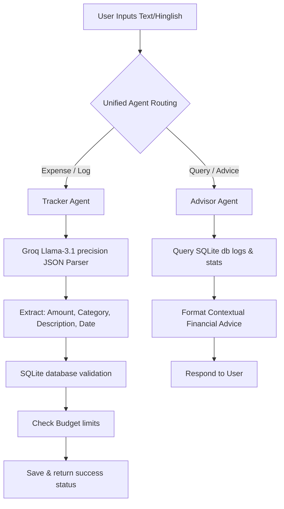
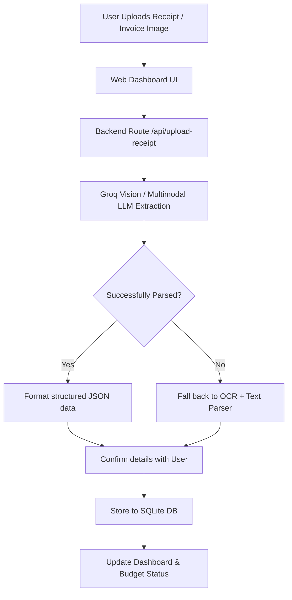
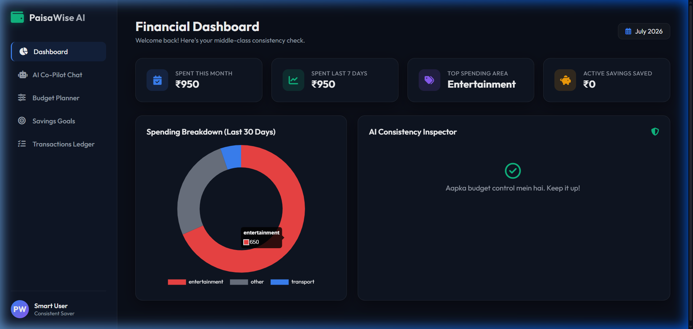
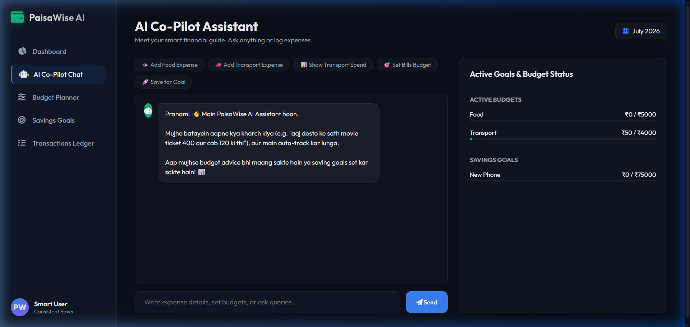
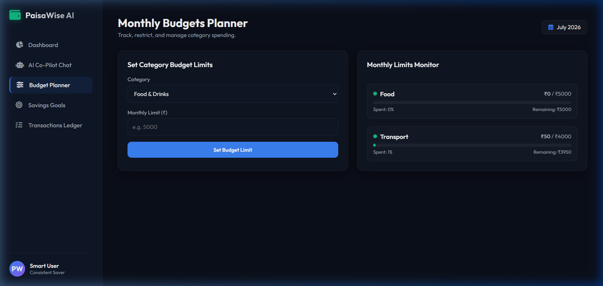
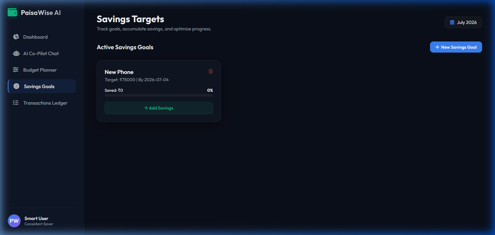
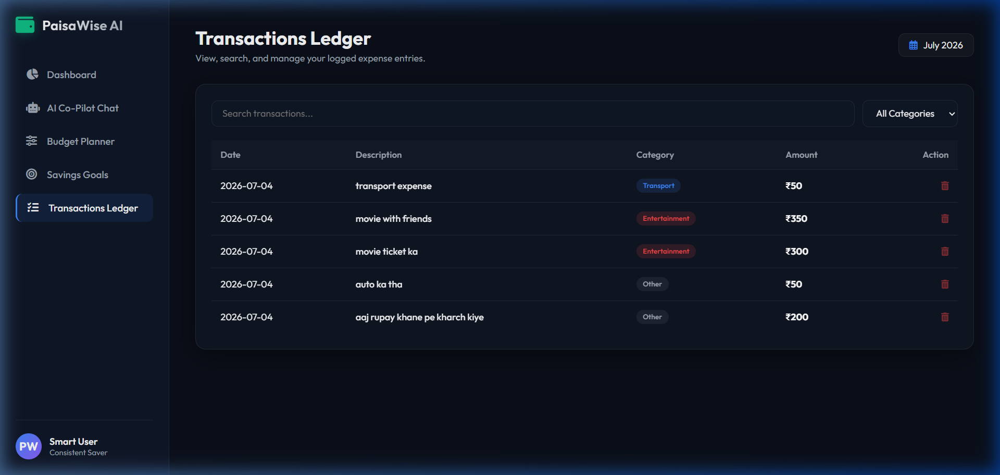

# 💰 Smart-Budget-Agent-AI

Smart Budget Agent is an intelligent personal finance assistant built with Flask, SQLite, and Groq LLMs. It is tailored for natural conversation (supporting English, Hindi, and Hinglish) to simplify daily expense tracking, budget limit management, and savings goals tracking.

---

## 🌟 Key Features

- **Natural Language Parsing**: Logs expenses from messages like *"Spent 150 on petrol"* or *"Dost ke sath dinner pe 1200 kharch ho gaye"*.
- **Smart Budget Guard**: Sets limits for spending categories and flags budget status in real time.
- **Goal Setter & Tracker**: Defines savings goals and updates current progress dynamically.
- **Smart-Budget-Agent Advisor**: Uses LLM capabilities to analyze spending habits and offer financial guidance.
- **Dynamic Visual Dashboard**: Features a responsive Web UI with interactive charts (Chart.js) and progress bars.

---

## 🔄 System Workflows

Here is how the intelligence flows within the Smart Budget Agent system.

### 1. Natural Language (Text) Expense Logging Workflow
This workflow runs when a user inputs a natural language description of an expense:



### 2. Proposed Image-Based Receipt & Bill Workflow
Planned workflow to support automated receipt parsing using Vision LLMs:



---

## 📊 Application Interface Previews

### 1. Main Dashboard
Provides real-time analytics, category spending breakdown, and AI consistency alerts.


### 2. AI Assistant Chat
Interact with Smart-Budget-Agent to log expenses via natural language, request advice, and track budgets.


### 3. Budget Planner
Configure monthly limits per spending category and monitor budget fills dynamically.


### 4. Savings Goals
Create financial milestones, track saved funds, and check progress towards goals.


### 5. Transactions Ledger
View your entire categorized history of logged expenses and manage records easily.


---

## 🛠️ Tech Stack

- **Backend**: Python, Flask
- **Database**: SQLite
- **AI/LLM Engine**: Groq Cloud API (`llama-3.1-8b-instant`)
- **Frontend**: HTML5, CSS3 (Vanilla Custom UI), JavaScript (ES6+), Chart.js
- **Environment Management**: `python-dotenv`

---

## 🚀 Getting Started

### 1. Clone the Repository
```bash
git clone https://github.com/omyadav3131/Smart-Budget-Agent-AI.git
cd Smart-Budget-Agent-AI
```

### 2. Install Dependencies
```bash
pip install -r requirements.txt
```

### 3. Set Up Environment Variables
Create a `.env` file in the root directory:
```env
GROQ_API_KEY=your_groq_api_key_here
```

### 4. Run the Application
```bash
python app.py
```

### 5. Access the Web Dashboard
Open [http://127.0.0.1:5000](http://127.0.0.1:5000) in your web browser.

---

## 📂 Project Directory Structure

```text
├── app.py                 # Flask server, routes, and API endpoints
├── agents.py              # AI agents (Tracker, Advisor, Unified Routing)
├── database.py            # SQLite database schema and operations
├── requirements.txt       # Python dependency list
├── .gitignore             # Standard Python ignore rules
├── templates/
│   └── index.html         # Rich dashboard frontend template
├── images/
│   └── dashboard-preview.svg # Dashboard layout preview SVG
└── tests/                 # Unit and integration test suite
```

